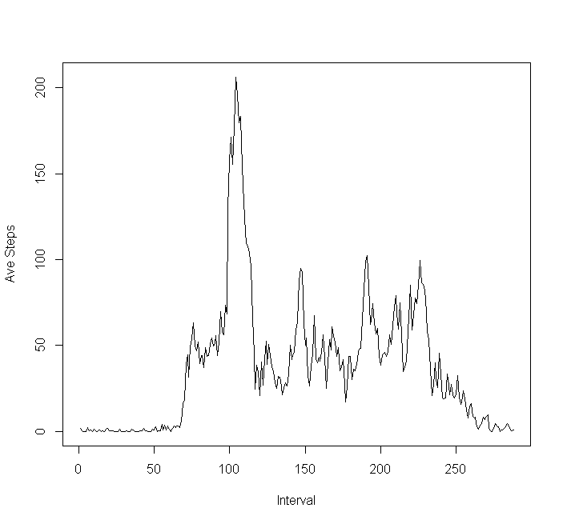
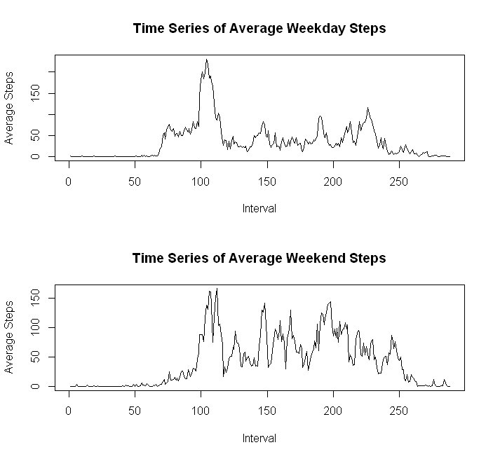

# Reproducible Research: Peer Assessment 1


## Loading and preprocessing the data

```r
setwd("C:/Users/Lovette Regner/Documents/GitHub/RepData_PeerAssessment1")
act <- read.csv("activity.csv")
```

## What is mean total number of steps taken per day?

```r
stepsDaily <- tapply(act$steps, act$date, sum)
histogram(stepsDaily, breaks = 15, xlab = "Total Steps Daily")
```

```
## Error: could not find function "histogram"
```

```r
mean <- mean(stepsDaily, na.rm = TRUE)
median <- median(stepsDaily, na.rm = TRUE)
```

The mean is 1.0766 &times; 10<sup>4</sup>, and the median is 10765.


## What is the average daily activity pattern?

```r
stepsPerInterval <- tapply(act$steps, act$interval, mean, na.rm = TRUE)
interval <- rownames(stepsPerInterval)
dailyAct <- cbind(interval, stepsPerInterval)
plot(stepsPerInterval, type = "l")
```

 

```r
maxInt <- dailyAct[dailyAct[,2] == max(stepsPerInterval),1]
```

The interval that contains the most number of steps is interval 835.


## Inputing missing values

```r
totalNA <- sum(is.na(act$steps))
actComplete <- act
for (i in 1:nrow(act))
{
     if (is.na(act$steps[i]))
     {
          actComplete[i,1] <- dailyAct[dailyAct[,1] == act$interval[i],2]
     }
}

newStepsDaily <- tapply(as.numeric(actComplete$steps), actComplete$date, sum)
histogram(newStepsDaily, breaks = 15, xlab = "Total Steps Daily (Complete Values)")
```

```
## Error: could not find function "histogram"
```

```r
newMean <- mean(newStepsDaily, na.rm = TRUE)
newMedian <- median(newStepsDaily, na.rm = TRUE)
```

The new mean is 1.0766 &times; 10<sup>4</sup>, and the new median is 1.0766 &times; 10<sup>4</sup>. Both values remained the same after using the average steps per interval to fill up the missing step values.

## Are there differences in activity patterns between weekdays and weekends?

```r
week <- weekdays(as.Date(actComplete$date))
for (i in 1:nrow(actComplete))
{
     if(week[i] == "Saturday" | week[i] == "Sunday")
     {
          week[i] <- "Weekend"
     }
     else
     {
          week[i] <- "Weekday"
     }
}

actWeek <- cbind(actComplete, week)
weekday <- actWeek[actWeek$week == "Weekday",]
weekend <- actWeek[actWeek$week == "Weekend",]
weekdayInterval <- tapply(as.numeric(weekday$steps), weekday$interval, mean, na.rm = TRUE)
weekendInterval <- tapply(as.numeric(weekend$steps), weekend$interval, mean, na.rm = TRUE)

par(mfcol = c(2,1))
plot(as.numeric(weekdayInterval), type = "l", ylab = "Average Steps", xlab = "Interval", main = "Time Series of Average Weekday Steps")
plot(weekendInterval, type = "l", ylab = "Average Steps", xlab = "Interval", main = "Time Series of Average Weekend Steps")
```

 
